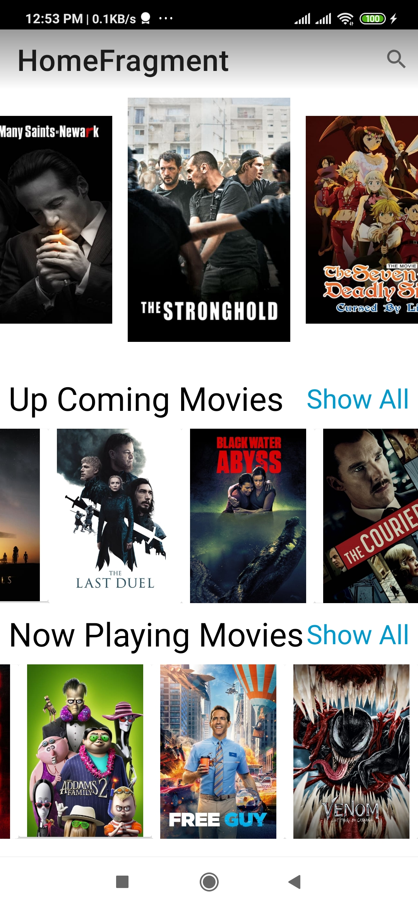
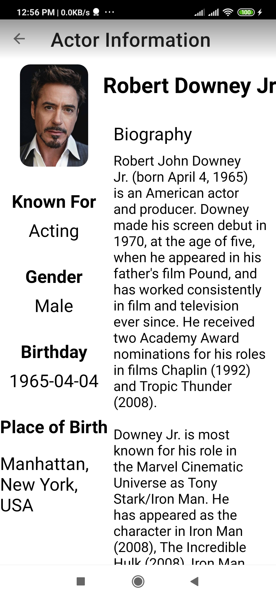
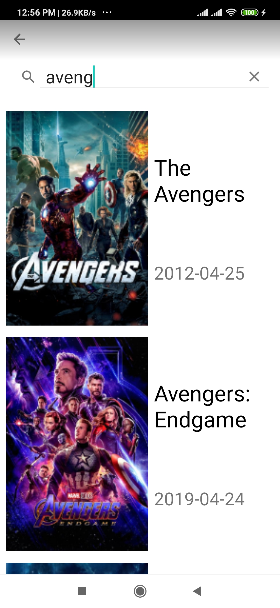
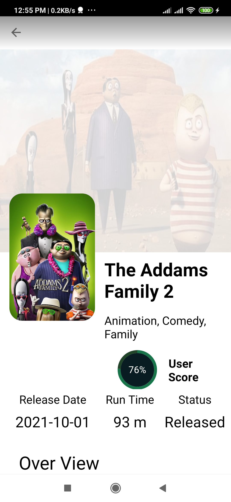
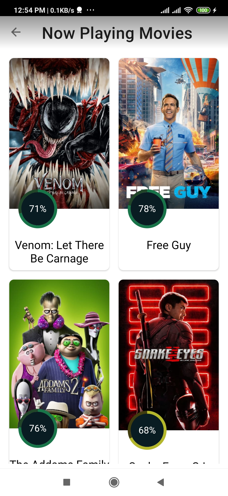
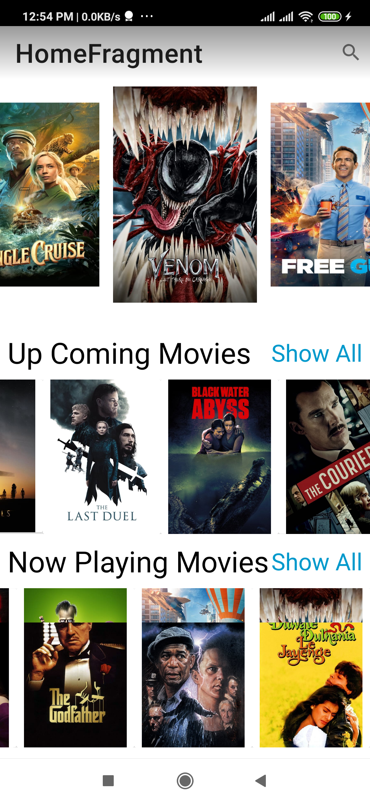
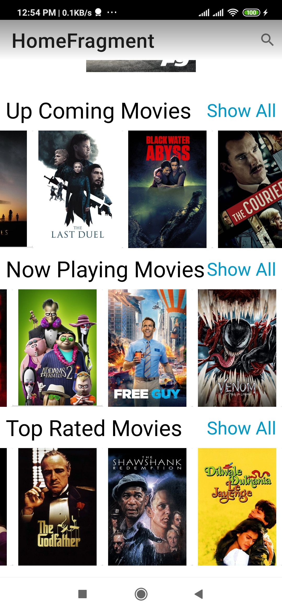

# Movies_App
 this app is a sample Android project using The Movie DB API based on MVVM architecture. It showcases the app development with well-designed architecture and up-to-date Android tech stacks.

# Screenshots

## Screenshots

    
    
    
    
    
    
    
    
    

#Video

https://user-images.githubusercontent.com/66850553/137734707-49c7cf5b-2179-48bd-b500-ed0aa9240726.mp4

## Tech Stacks
* [Retrofit](http://square.github.io/retrofit/) + [OkHttp](http://square.github.io/okhttp/) - RESTful API and networking client.
* [Paging 3 ](https://developer.android.com/topic/libraries/architecture/paging/v3-migration) - Pagination loading for RecyclerView.
* [ViewModel](https://developer.android.com/reference/androidx/lifecycle/ViewModel) - UI related data holder, lifecycle aware.
* [LiveData](https://developer.android.com/topic/libraries/architecture/livedata) - Observable data holder that notify views when underlying data changes.
* [View Binding](https://developer.android.com/topic/libraries/view-binding) - Declarative way to bind data to UI layout.
* [Navigation component](https://developer.android.com/guide/navigation) - Fragment routing handler. 
* [Glide](https://github.com/bumptech/glide) - Image loading.
* [Coroutines](https://developer.android.com/kotlin/coroutines) - Light-weight threads for background operations. 
* [viewpager2](https://developer.android.com/jetpack/androidx/releases/viewpager2)
* [MPAndroidChart](https://github.com/PhilJay/MPAndroidChart) - MPAndroidChart is a powerful & easy to use chart library for Android
